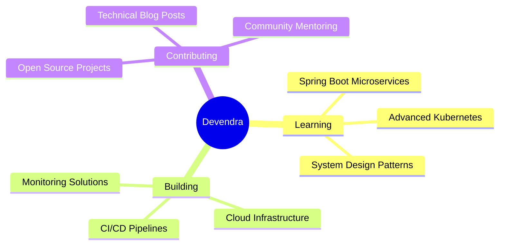

<div align="center">

# 🚀 Welcome to My Digital Universe


[](https://github.com/devendra-ry)

</div>

---

## 🎯 About Me

```javascript
const devendra = {
    pronouns: "he/him",
    location: "India 🇮🇳",
    currentFocus: "Building scalable systems & cloud infrastructure",
    learning: ["Spring Boot", "Microservices", "Kubernetes"],
    askMeAbout: ["DevOps", "Cloud Architecture", "System Design"],
    funFact: "I debug with console.log and I'm proud of it! 😄"
};
```

<div align="center">

### 🌟 Current Mission
*"Transforming ideas into scalable digital solutions, one commit at a time"*

</div>

---

## 🛠️ Tech Arsenal

<div align="center">

### ☁️ Cloud & DevOps


### 💻 Programming Languages


### 🗄️ Databases & Tools


### 🚀 Frameworks & Platforms


</div>

---

## 📈 GitHub Analytics

<div align="center">


</div>

<div align="center">

[](https://git.io/streak-stats)

</div>

<div align="center">


</div>

---

## 🏆 GitHub Trophies

<div align="center">

[](https://github.com/ryo-ma/github-profile-trophy)

</div>

---

## 🎯 What I'm Working On

<div align="center">



</div>

---

## 🌟 Featured Projects

<div align="center">

<a href="https://github.com/devendra-ry">

</a>
<a href="https://github.com/devendra-ry">

</a>

</div>

---

## 💡 Random Dev Quote

<div align="center">


</div>

---

## 🤝 Let's Connect & Collaborate

<div align="center">

<a href="mailto:YadavDevendra@protonmail.com">

</a>
<a href="https://linkedin.com/in/devendra-yadav">

</a>
<a href="https://twitter.com/devendra_ry">

</a>
<a href="https://dev.to/devendra_ry">

</a>

</div>

---

<div align="center">


### Thanks for stopping by! Let's build something amazing together! 🚀


</div>
